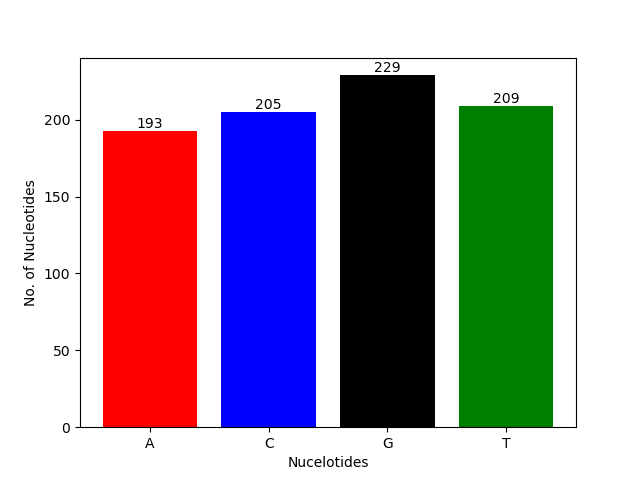
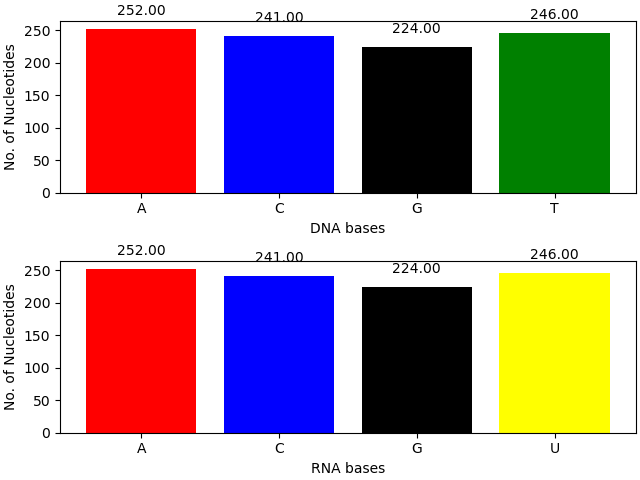

# Rosalind-with-Visualizations
My solutions to problems from [Rosalind](https://rosalind.info/problems/list-view/) with visualization components 

## Question 1: DNA

The problem given was to count the number of bases in the DNA Sequence given. Used Matplotlib to create the below visualization: 

## Question 2: RNA

The problem given was to convert a DNA strand to an RNA strand. Used Matplotlib and biopython library to wrangle the data and create the below visualization: 

